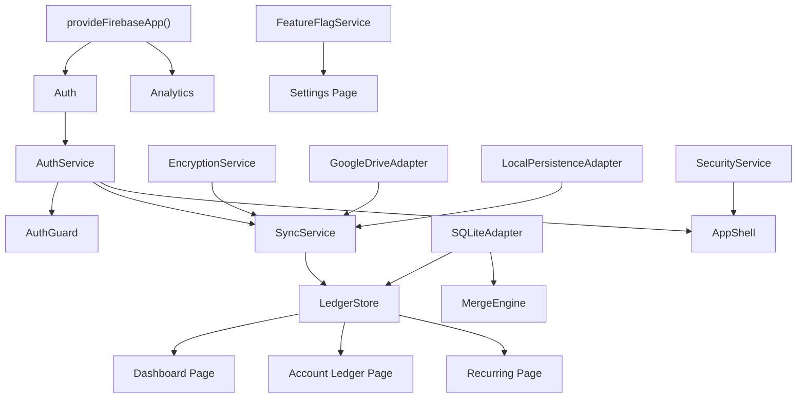

# Angular Application Architecture

> **Purpose:** Canonical architecture specification for the Angular 21 version of Path Logic, including project structure, DI hierarchy, state management patterns, and component tree.

---

## 1. Monorepo Structure

```
path-logic/
├── apps/
│   └── web/                          # Angular 21 Application
│       ├── src/
│       │   ├── app/
│       │   │   ├── app.component.ts          # Root component
│       │   │   ├── app.config.ts             # Application config (providers)
│       │   │   ├── app.routes.ts             # Route definitions
│       │   │   ├── guards/
│       │   │   │   └── auth.guard.ts         # canActivate guard
│       │   │   ├── services/                 # Injectable services (state + IO)
│       │   │   │   ├── auth.service.ts       # Firebase Auth wrapper
│       │   │   │   ├── ledger.store.ts       # Signal-based ledger state
│       │   │   │   ├── user.store.ts         # Signal-based user settings
│       │   │   │   ├── sqlite.adapter.ts     # sql.js WASM adapter
│       │   │   │   ├── encryption.service.ts # AES-GCM crypto
│       │   │   │   ├── google-drive.adapter.ts
│       │   │   │   ├── sync.service.ts       # Orchestrates sync pipeline
│       │   │   │   ├── merge-engine.ts       # SQLite merge logic
│       │   │   │   ├── local-persistence.adapter.ts
│       │   │   │   ├── feature-flag.service.ts
│       │   │   │   └── security.service.ts   # Idle detection
│       │   │   ├── layout/                   # Shell components
│       │   │   │   ├── app-shell/
│       │   │   │   ├── header/
│       │   │   │   ├── footer/
│       │   │   │   ├── breadcrumb-nav/
│       │   │   │   └── security-overlay/
│       │   │   ├── pages/                    # Routed page components
│       │   │   │   ├── dashboard/
│       │   │   │   ├── accounts/
│       │   │   │   ├── account-detail/
│       │   │   │   ├── payees/
│       │   │   │   └── settings/
│       │   │   ├── features/                 # Feature-specific components
│       │   │   │   ├── auth/
│       │   │   │   ├── ledger/
│       │   │   │   ├── onboarding/
│       │   │   │   ├── recurring/
│       │   │   │   └── sync/
│       │   │   └── ui/                       # Shared UI primitives
│       │   │       ├── button/
│       │   │       ├── card/
│       │   │       ├── dialog/
│       │   │       ├── input/
│       │   │       ├── select/
│       │   │       ├── table/
│       │   │       └── ...
│       │   ├── environments/
│       │   │   ├── environment.ts            # Development config
│       │   │   ├── environment.staging.ts    # Staging config
│       │   │   └── environment.prod.ts       # Production config
│       │   ├── styles.css                    # Global Tailwind + design tokens
│       │   └── index.html
│       ├── e2e/                              # Playwright tests (ported)
│       ├── .storybook/                       # Storybook config
│       ├── project.json                      # Nx project config
│       └── tsconfig.app.json
├── packages/
│   ├── core/                                 # Shared pure TS logic
│   └── feature-flags/                        # Angular signal-based flags
├── nx.json
├── firebase.json
├── .firebaserc
├── package.json
└── tsconfig.base.json
```

---

## 2. Dependency Injection Hierarchy



All services are `providedIn: 'root'` (singleton). No module-level providers needed.

---

The application uses Angular Signal Stores. Here's the canonical pattern:

```typescript
import { Injectable, signal, computed } from '@angular/core';
import type { ITransaction, IAccount } from '@path-logic/core';

@Injectable({ providedIn: 'root' })
export class LedgerStore {
    // === State Signals (always use generic Array<T> syntax) ===
    readonly transactions = signal<Array<ITransaction>>([]);
    readonly accounts = signal<Array<IAccount>>([]);
    readonly isLoading = signal(false);
    readonly isInitialized = signal(false);
    readonly isDirty = signal(false);
    readonly syncStatus = signal<'synced' | 'pending-local' | 'error'>('synced');

    // === Computed Values ===
    readonly netPosition = computed(() =>
        this.transactions().reduce((sum, tx) => sum + tx.totalAmount, 0)
    );

    readonly clearedBalance = computed(() =>
        this.transactions()
            .filter(tx => tx.status === TransactionStatus.Cleared)
            .reduce((sum, tx) => sum + tx.totalAmount, 0)
    );

    // === Actions ===
    async initialize(): Promise<void> {
        this.isLoading.set(true);
        try {
            await initDatabase();
            this.transactions.set(getAllTransactions());
            this.accounts.set(getAllAccounts());
            this.isInitialized.set(true);
        } finally {
            this.isLoading.set(false);
        }
    }

    async addTransaction(tx: ITransaction): Promise<void> {
        insertTransaction(tx);
        this.transactions.set(getAllTransactions());
        this.isDirty.set(true);
    }
}
```

---

## 4. Route Guard & Routing

> [!NOTE]
> All Angular patterns use **functional implementations**. The `authGuard` is a `canActivateFn` applied **once at the parent route level** so child routes inherit protection automatically.

```typescript
import { inject } from '@angular/core';
import { type CanActivateFn, Router } from '@angular/router';
import { AuthService } from '../services/auth.service';

export const authGuard: CanActivateFn = (): boolean | UrlTree => {
    const auth = inject(AuthService);
    const router = inject(Router);

    if (auth.isLoggedIn()) {
        return true;
    }

    return router.createUrlTree(['/sign-in']);
};
```

Applied at the parent level via route grouping:

```typescript
export const routes: Routes = [
    // Public route
    { path: 'sign-in', loadComponent: () => import('./pages/sign-in/sign-in.component') },

    // Protected routes — authGuard applied ONCE here
    {
        path: '',
        canActivate: [authGuard],
        children: [
            { path: '', loadComponent: () => import('./pages/dashboard/dashboard.component') },
            {
                path: 'accounts',
                loadComponent: () => import('./pages/accounts/accounts.component')
            },
            {
                path: 'accounts/:accountId',
                loadComponent: () => import('./pages/account-detail/account-detail.component')
            },
            { path: 'payees', loadComponent: () => import('./pages/payees/payees.component') },
            {
                path: 'settings',
                loadComponent: () => import('./pages/settings/settings.component')
            },
            {
                path: 'settings/dev/auth',
                loadComponent: () => import('./pages/settings/dev-auth/dev-auth.component')
            },
            {
                path: 'settings/dev/maintenance',
                loadComponent: () =>
                    import('./pages/settings/dev-maintenance/dev-maintenance.component')
            },
            {
                path: 'settings/ff',
                loadComponent: () =>
                    import('./pages/settings/feature-flags/feature-flags.component')
            }
        ]
    },

    { path: '**', redirectTo: '' }
];
```

---

## 5. Sync Manager (Service)

The `SyncManager` is a pure service initialized at app startup:

```typescript
@Injectable({ providedIn: 'root' })
export class SyncManagerService {
    private readonly auth = inject(AuthService);
    private readonly ledger = inject(LedgerStore);
    private readonly sync = inject(SyncService);

    constructor() {
        // Effect: auto-sync when isDirty changes
        effect(() => {
            const dirty = this.ledger.isDirty();
            const token = this.auth.accessToken();
            const userId = this.auth.userId();

            if (dirty && token && userId) {
                this.sync.saveToDrive(token, userId);
            }
        });
    }

    async initialLoad(): Promise<void> {
        // Wait for silent auto-login to complete before syncing
        const token = this.auth.accessToken();
        const userId = this.auth.userId();
        if (token && userId) {
            await this.sync.loadFromDrive(token, userId);
        }
    }
}
```

Initialized in `app.component.ts` — waits for auth to resolve:

```typescript
@Component({ ... })
export class AppComponent {
    private readonly syncManager = inject(SyncManagerService);
    private readonly auth = inject(AuthService);

    constructor() {
        // Only trigger initial load after silent auto-login resolves
        effect(() => {
            if (!this.auth.isInitializing() && this.auth.isLoggedIn()) {
                this.syncManager.initialLoad();
            }
        });
    }
}
```

---

## 6. UI Component Strategy

### Radix UI → Angular CDK

| Radix Primitive                 | Angular Equivalent                                         |
| ------------------------------- | ---------------------------------------------------------- |
| `@radix-ui/react-dialog`        | Angular CDK `Dialog` or custom overlay                     |
| `@radix-ui/react-dropdown-menu` | Angular CDK `Overlay` + `CdkMenu`                          |
| `@radix-ui/react-context-menu`  | Angular CDK `Overlay` + `CdkMenu` with right-click trigger |
| `@radix-ui/react-popover`       | Angular CDK `Overlay`                                      |
| `@radix-ui/react-scroll-area`   | Angular CDK `ScrollingModule` (`cdkVirtualScrollViewport`) |
| `@radix-ui/react-select`        | Custom select with CDK `Overlay`                           |
| `@radix-ui/react-switch`        | Custom toggle (pure CSS + Angular binding)                 |
| `@radix-ui/react-checkbox`      | Custom checkbox (pure CSS + Angular binding)               |
| `@radix-ui/react-tabs`          | Angular CDK `CdkTabGroup` or custom                        |
| `@radix-ui/react-slot`          | Angular `ng-content` projection                            |

### Design System Preservation

All Tailwind CSS classes transfer 1:1. The current `globals.css` becomes `styles.css` in Angular with identical CSS custom properties (design tokens). The visual design is preserved exactly.

### Calculator Input

`calculator-input.tsx` uses `mathjs` for inline math evaluation. This is framework-agnostic — the Angular version will use the same `mathjs` dependency with an Angular form control.

---

Environment files implement the `IEnvironment` interface:

```typescript
// models/environment.model.ts
export interface IFirebaseConfig {
    readonly apiKey: string;
    readonly authDomain: string;
    readonly projectId: string;
    readonly storageBucket: string;
    readonly messagingSenderId: string;
    readonly appId: string;
    readonly measurementId?: string;
}

export interface IEnvironment {
    readonly production: boolean;
    readonly appEnv: 'development' | 'staging' | 'production';
    readonly firebase: IFirebaseConfig;
}
```

```typescript
import type { IEnvironment } from '../app/models/environment.model';

// environments/environment.ts (development)
export const environment: IEnvironment = {
    production: false,
    appEnv: 'development',
    firebase: {
        apiKey: '...',
        authDomain: 'localhost',
        projectId: 'path-logic-dev',
        storageBucket: 'path-logic-dev.appspot.com',
        messagingSenderId: '...',
        appId: '...'
    }
};

// environments/environment.staging.ts
export const environment: IEnvironment = {
    production: false,
    appEnv: 'staging',
    firebase: {
        apiKey: '...',
        authDomain: 'staging.pathlogicfinance.com',
        projectId: 'path-logic-staging',
        storageBucket: 'path-logic-staging.appspot.com',
        messagingSenderId: '...',
        appId: '...'
    }
};

// environments/environment.prod.ts
export const environment: IEnvironment = {
    production: true,
    appEnv: 'production',
    firebase: {
        apiKey: '...',
        authDomain: 'pathlogicfinance.com',
        projectId: 'path-logic-prod',
        storageBucket: 'path-logic-prod.appspot.com',
        messagingSenderId: '...',
        appId: '...'
    }
};
```

Usage in services:

```typescript
import { environment } from '../../environments/environment';

// Instead of: process.env['NEXT_PUBLIC_APP_ENV']
const appEnv: IEnvironment['appEnv'] = environment.appEnv;
```

---

## 8. Architectural Summary

| ------------------------ | ---------------------------------------- | ------------------------------------------------ |
| **SSR** | Default (App Router renders server-side) | None (SPA only — no SSR needed for this app) |
| **Code splitting** | Automatic per-route | Lazy-loaded routes via `loadComponent` |
| **API routes** | `app/api/auth/[...nextauth]/route.ts` | None — fully client-side (Firebase Auth) |
| **Middleware** | `middleware.ts` runs on edge | Route guards run client-side |
| **Session storage** | Server-side JWT (NextAuth) | Client-side Firebase Auth token |
| **Cookie domain issues** | `.pathlogicfinance.com` cross-subdomain | No cookies for auth — Firebase uses IndexedDB |
| **Preview deploys** | Vercel automatic | Firebase Hosting preview channels (CLI-driven) |
| **Build output** | `.next/` (proprietary) | `dist/apps/web/browser/` (standard static files) |
