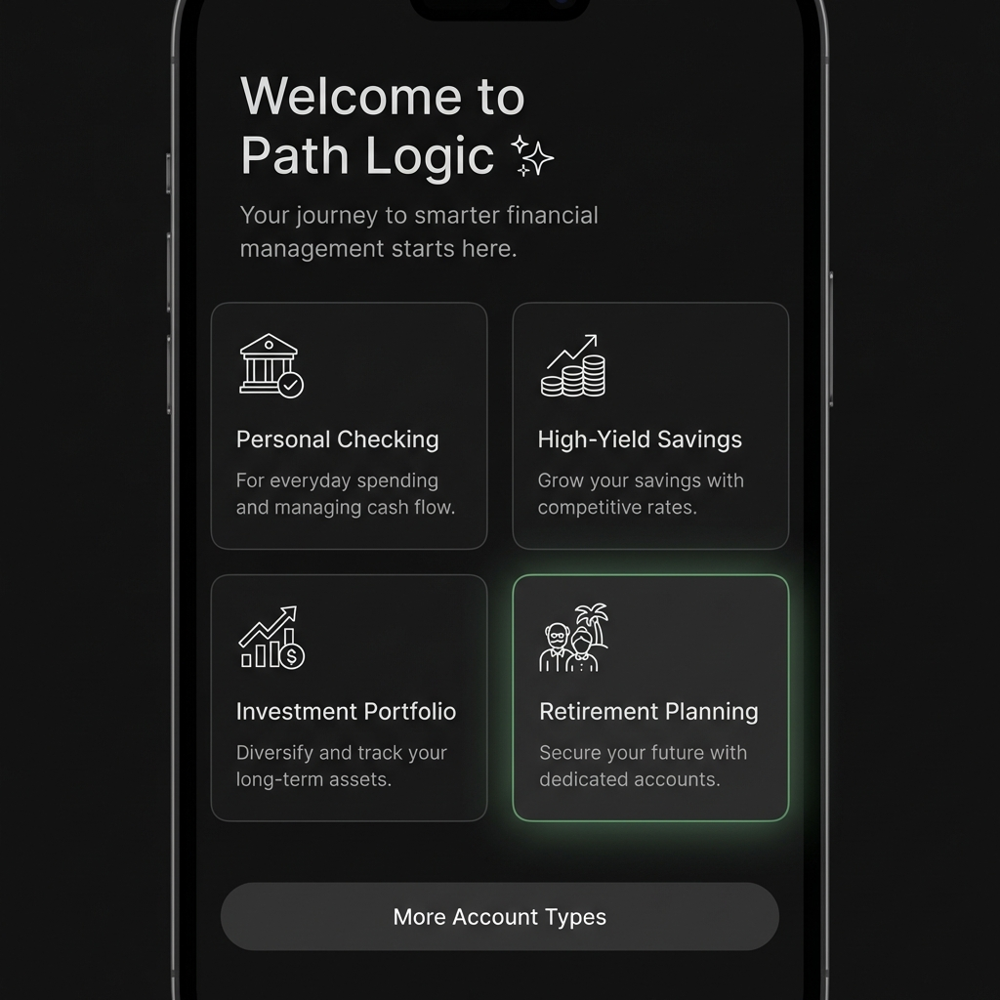
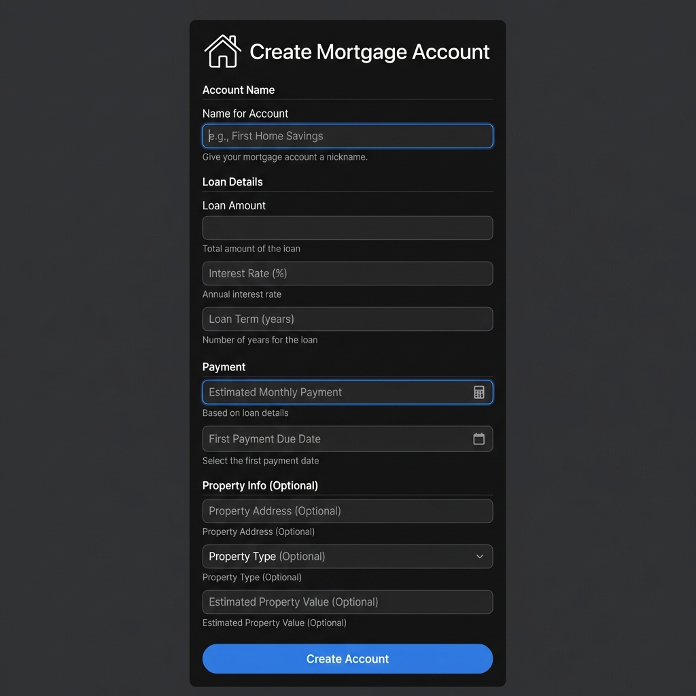

# Loan Account Types - Project Plan

## Overview

Extend the welcome wizard to support loan account types (Mortgage, Auto Loan, Personal Loan) with loan-specific settings and tracking capabilities. Implement a "More Account Types" expansion UI to keep the primary selection clean while offering advanced options.

## Business Value

- **Complete Financial Picture**: Users can track all accounts including debt obligations
- **Loan Management**: Track principal, interest, payment schedules, and payoff progress
- **Better Projections**: 90-day cashflow can include scheduled loan payments
- **Competitive Feature**: Most personal finance apps treat loans as second-class citizens

## User Experience Goals

### Primary Account Types (Always Visible)
- Checking Account
- Savings Account
- Credit Card
- Cash

### Loan Account Types (Expandable Section)
- Mortgage
- Auto Loan
- Personal Loan

### UI Flow
1. User sees 4 primary account type cards
2. "More Account Types" button/link at bottom
3. Click expands to show 3 additional loan type cards
4. Loan types have distinct visual treatment (different icon style/color)
5. Selecting a loan type shows enhanced form with loan-specific fields

## Loan-Specific Settings

### Common Loan Fields
- **Account Name**: e.g., "Home Mortgage", "Honda Civic Loan"
- **Institution Name**: Lender name
- **Current Balance**: Outstanding principal (negative value)
- **Original Loan Amount**: Initial principal
- **Interest Rate (APR)**: Annual percentage rate
- **Loan Term**: Months (e.g., 360 for 30-year mortgage)
- **Monthly Payment**: Fixed payment amount
- **Payment Due Date**: Day of month (1-31)
- **Loan Start Date**: Origination date

### Loan Type Specifics

**Mortgage**
- Property address (optional)
- Property value (optional)
- Escrow included (yes/no)
- Escrow amount (if applicable)

**Auto Loan**
- Vehicle make/model (optional)
- Vehicle year (optional)
- VIN (optional)

**Personal Loan**
- Loan purpose (optional)
- Secured/Unsecured

## Technical Architecture

### Core Domain Updates

**AccountType Enum** (packages/core/src/domain/types.ts)
```typescript
export enum AccountType {
    Checking = 'CHECKING',
    Savings = 'SAVINGS',
    Credit = 'CREDIT',
    Cash = 'CASH',
    Mortgage = 'MORTGAGE',
    AutoLoan = 'AUTO_LOAN',
    PersonalLoan = 'PERSONAL_LOAN'
}
```

**IAccount Interface Extension**
```typescript
export interface IAccount {
    // ... existing fields
    
    // Loan-specific fields (optional, only for loan types)
    loanDetails?: ILoanDetails;
}

export interface ILoanDetails {
    originalAmount: Cents;
    interestRate: number; // APR as decimal (e.g., 0.0375 for 3.75%)
    termMonths: number;
    monthlyPayment: Cents;
    paymentDueDay: number; // 1-31
    startDate: ISODateString;
    
    // Type-specific metadata
    metadata?: IMortgageMetadata | IAutoLoanMetadata | IPersonalLoanMetadata;
}

export interface IMortgageMetadata {
    propertyAddress?: string;
    propertyValue?: Cents;
    escrowIncluded: boolean;
    escrowAmount?: Cents;
}

export interface IAutoLoanMetadata {
    vehicleMake?: string;
    vehicleModel?: string;
    vehicleYear?: number;
    vin?: string;
}

export interface IPersonalLoanMetadata {
    purpose?: string;
    secured: boolean;
}
```

### UI Components

**WelcomeWizard Updates**
- Add "More Account Types" expansion section
- Add loan-specific form step
- Implement loan details form with validation

**New Component: LoanDetailsForm**
- Reusable form for loan-specific fields
- Type-specific metadata fields
- Interest rate calculator helper
- Payment schedule preview

### Database Schema

**SQLite Schema Updates**
```sql
-- Add loan_details table
CREATE TABLE IF NOT EXISTS loan_details (
    account_id TEXT PRIMARY KEY,
    original_amount INTEGER NOT NULL,
    interest_rate REAL NOT NULL,
    term_months INTEGER NOT NULL,
    monthly_payment INTEGER NOT NULL,
    payment_due_day INTEGER NOT NULL,
    start_date TEXT NOT NULL,
    metadata TEXT, -- JSON for type-specific data
    FOREIGN KEY (account_id) REFERENCES accounts(id)
);
```

## Implementation Phases

### Phase 1: Core Domain (packages/core)
- [ ] Add new AccountType enum values
- [ ] Define ILoanDetails and metadata interfaces
- [ ] Update IAccount interface
- [ ] Add loan validation utilities
- [ ] Add loan calculation utilities (amortization, interest)

### Phase 2: Database Layer (apps/web/src/lib/storage)
- [ ] Update SQLite schema with loan_details table
- [ ] Add loan details CRUD operations
- [ ] Update account insertion to handle loan details
- [ ] Add migration for existing databases

### Phase 3: UI Components (apps/web/src/components)
- [ ] Update WelcomeWizard with expandable section
- [ ] Create LoanDetailsForm component
- [ ] Add loan-specific icons
- [ ] Implement form validation
- [ ] Add payment schedule preview

### Phase 4: Integration & Testing
- [ ] Update ledger store to handle loan accounts
- [ ] Test account creation flow
- [ ] Test loan calculations
- [ ] Verify database persistence
- [ ] Test expansion UI interaction

### Phase 5: Polish & Documentation
- [ ] Add tooltips for loan fields
- [ ] Create help documentation
- [ ] Update project plan
- [ ] Lint and format all code
- [ ] Commit and push

## UI Mockups

### Step 1: Primary Account Types (Initial View)



**Design Principles:**
- **Soft Box Shadows**: Subtle elevation with `box-shadow: 0 4px 6px -1px rgba(0, 0, 0, 0.3)`
- **No Neon Glow**: Clean, modern aesthetic without dated glow effects
- **Minimal Icons**: Simple line art style, not overly detailed
- **Ample Whitespace**: Generous spacing between cards and content
- **Approachable**: Professional but consumer-friendly

**Layout:**
- Welcome header with small sparkles icon
- 4 primary account type cards in 2x2 grid
- "More Account Types" button centered at bottom
- Soft hover states with subtle lift effect

### Step 2: Expanded View with Loan Types (Large Viewport)


**Design Highlights:**
- **Large Viewport**: Designed for 1920x1080 desktop experience
- **Vibrant Loan Accents**: Bright amber/orange (#f59e0b) beautifully contrasts dark background
- **2-Column Loan Layout**: 
  - Row 1: Mortgage | Auto Loan
  - Row 2: Personal Loan (centered)
- **Visual Hierarchy**: Loan cards clearly distinguished from primary types
- **Excellent Spacing**: Generous margins and padding throughout

**Color Strategy:**
- Primary accounts: Subtle green accents
- Loan accounts: **Vibrant warm amber/orange** - creates visual excitement against dark background
- Maintains professional feel while being consumer-friendly

### Step 3: Mortgage Details Form (Consumer-Friendly)



**Consumer-Grade Design:**
- **Column-Oriented Layout**: Single column for easy scanning and completion
- **Excellent Whitespace**: 24px spacing between fields, breathing room throughout
- **Accessibility First**:
  - Large input fields (48px height) for easy interaction
  - High contrast labels (14px, clear hierarchy)
  - Helper text below each field in muted color
  - Clear focus states with visible borders
  - Optional fields clearly marked

**Form Sections:**
1. **Account Name**: Single field with example placeholder
2. **Loan Details**: Amount, Rate, Term stacked vertically
3. **Payment**: Monthly payment with calculator icon, due date
4. **Property Info (Optional)**: Address, value, type - clearly marked as optional

**Interaction Design:**
- Large "Create Account" button (56px height) at bottom
- Calculator icon for auto-calculation affordance
- Date picker for due date field
- Dropdown for property type
- Clean, friendly, approachable aesthetic

### Step 4: Auto Loan Form

**Form Sections:**
1. **Account Details**: Name, Institution
2. **Loan Terms**: Original Amount, Current Balance, Interest Rate, Term
3. **Payment Info**: Monthly Payment, Due Date
4. **Vehicle Details**: Make, Model, Year, VIN

**Example Values:**
- Name: "Honda Civic Loan"
- Make: "Honda"
- Model: "Civic"
- Year: "2023"
- VIN: "1HGBH41JXMN109186"

### Step 5: Personal Loan Form

**Form Sections:**
1. **Account Details**: Name, Institution
2. **Loan Terms**: Original Amount, Current Balance, Interest Rate, Term
3. **Payment Info**: Monthly Payment, Due Date
4. **Loan Details**: Purpose, Secured/Unsecured toggle

**Example Values:**
- Name: "Debt Consolidation Loan"
- Purpose: "Consolidate credit card debt"
- Secured: No

### Payment Calculator Helper

**Display:**
- Input fields: Principal, Interest Rate, Term
- Calculated results in highlighted box:
  - Monthly Payment (large, primary color)
  - Total Interest
  - Payoff Date
- Info icons with tooltips
- Monospace fonts for numbers

## Detailed Layout Specifications

### Grid System

**Primary Types (2x2 Grid):**
```
┌──────────────────┐  ┌──────────────────┐
│   Checking       │  │   Savings        │
│   [Icon]         │  │   [Icon]         │
│   Description    │  │   Description    │
└──────────────────┘  └──────────────────┘

┌──────────────────┐  ┌──────────────────┐
│   Credit Card    │  │   Cash           │
│   [Icon]         │  │   [Icon]         │
│   Description    │  │   Description    │
└──────────────────┘  └──────────────────┘
```

**Loan Types (2-Column Layout):**
```
        ┌─────────────────────────┐
        │ ⊕ More Account Types    │
        └─────────────────────────┘
                  ↓ (expands)

┌──────────────────┐  ┌──────────────────┐
│   Mortgage       │  │   Auto Loan      │
│   [Home Icon]    │  │   [Car Icon]     │
│   Home loan      │  │   Vehicle loan   │
└──────────────────┘  └──────────────────┘

        ┌──────────────────┐
        │   Personal Loan  │
        │   [Receipt Icon] │
        │   Personal debt  │
        └──────────────────┘
```

### Spacing & Sizing

**Card Dimensions:**
- **Card Width**: ~280px each
- **Card Height**: ~180px
- **Gap Between Cards**: 20px horizontal, 16px vertical
- **Grid Container Max Width**: 600px
- **Card Border Radius**: 8px (modern, friendly)

**Form Fields:**
- **Input Height**: 48px (accessible, easy to tap/click)
- **Label Font Size**: 14px (readable, clear hierarchy)
- **Helper Text**: 12px muted color
- **Field Spacing**: 24px between fields (excellent breathing room)
- **Section Spacing**: 32px between sections

**Animations:**
- **Expansion**: 300ms ease-in-out
- **Card Hover**: 200ms ease-out with subtle lift
- **Focus States**: Immediate with smooth border transition

### Visual Effects

**Box Shadows (Soft, Not Neon):**
- **Card Rest State**: `0 4px 6px -1px rgba(0, 0, 0, 0.3), 0 2px 4px -1px rgba(0, 0, 0, 0.06)`
- **Card Hover State**: `0 10px 15px -3px rgba(0, 0, 0, 0.3), 0 4px 6px -2px rgba(0, 0, 0, 0.05)`
- **No Glow Effects**: Clean, modern aesthetic without dated neon glows

**Focus States (Accessibility):**
- **Visible Border**: 2px solid primary color
- **Outline Offset**: 2px for clear visual separation
- **High Contrast**: Meets WCAG AA standards

### Color Palette

**Primary Account Types:**
- **Background**: `#0a0a0a` (very dark, high contrast)
- **Border**: `rgba(255, 255, 255, 0.1)` (subtle)
- **Hover Border**: `#22c55e` (primary green)
- **Text**: `#ffffff` (high contrast for accessibility)
- **Muted Text**: `#a1a1aa` (readable, WCAG AA compliant)

**Loan Account Types:**
- **Background**: `#0a0a0a` (same as primary)
- **Border**: `rgba(251, 146, 60, 0.3)` (warm amber)
- **Hover Border**: `#f59e0b` (vibrant amber-500)
- **Accent Color**: `#f59e0b` - **Bright, warm, visually exciting against dark background**
- **Text**: `#ffffff` (high contrast)

**Form Elements:**
- **Input Background**: `#1a1a1a` (slightly lighter than card)
- **Input Border**: `rgba(255, 255, 255, 0.15)`
- **Input Focus Border**: `#22c55e` or `#f59e0b` (depending on context)
- **Placeholder**: `#71717a` (muted but readable)
- **Helper Text**: `#a1a1aa` (muted)
- **Error**: `#ef4444` (red-500, high contrast)

### Typography

**Hierarchy:**
- **Page Title**: 28px, bold, letter-spacing: -0.02em
- **Subtitle**: 16px, regular, muted color
- **Card Title**: 18px, semibold
- **Card Description**: 14px, regular, muted
- **Form Section Header**: 16px, semibold, uppercase, letter-spacing: 0.05em
- **Form Labels**: 14px, medium weight
- **Input Text**: 16px, regular (larger for accessibility)
- **Helper Text**: 12px, regular, muted
- **Button Text**: 16px, semibold

**Font Stack:**
- Primary: `Inter, -apple-system, BlinkMacSystemFont, 'Segoe UI', sans-serif`
- Monospace (for numbers): `'JetBrains Mono', 'Fira Code', monospace`

### Accessibility Standards

**WCAG 2.1 AA Compliance:**
- **Color Contrast**: Minimum 4.5:1 for normal text, 3:1 for large text
- **Focus Indicators**: Visible 2px border with 2px offset
- **Touch Targets**: Minimum 48x48px for all interactive elements
- **Keyboard Navigation**: Full support with visible focus states
- **Screen Reader**: Proper ARIA labels and semantic HTML
- **Form Validation**: Clear error messages associated with fields via `aria-describedby`

**Consumer-Friendly Principles:**
- **Generous Whitespace**: Reduces cognitive load
- **Clear Hierarchy**: Easy to scan and understand
- **Helpful Hints**: Contextual help text for every field
- **Forgiving Inputs**: Accept various formats, auto-format where possible
- **Progress Indication**: Clear steps and current position
- **Error Recovery**: Helpful error messages with suggestions

## Success Criteria

- ✅ Users can create loan accounts through wizard
- ✅ Loan-specific fields are properly validated
- ✅ Loan details persist to database
- ✅ UI clearly distinguishes between primary and loan account types
- ✅ All TypeScript strict typing requirements met
- ✅ All linting and formatting passes
- ✅ Code committed and pushed to repository
