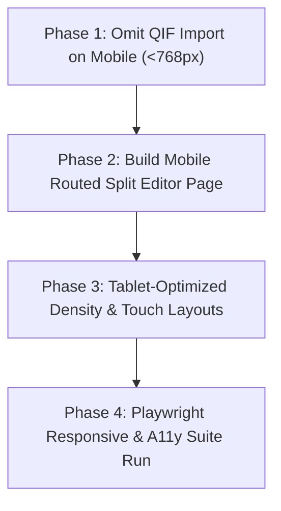

# Path Logic: Mobile & Tablet Refinements Execution Plan

## 1. Executive Summary & Goals

This plan operationalizes the approved refinements to Path Logic's responsive architecture:

1. **Phase 1: QIF / CSV Import Clean Removal on Small Viewports (`< 768px`)**:
    - Completely omit QIF/CSV import triggers, buttons, and dialogs from the DOM on Small viewports (`< 768px`) via `@if (isMediumOrLarge())`.
    - Update [`docs/specs/viewport_feature_matrix.md`](file:///home/pete/projects/path-logic/docs/specs/viewport_feature_matrix.md).
2. **Phase 2: Dedicated Routed Full-Page Split Transaction Editor for Mobile**:
    - Create a dedicated mobile route (`/accounts/:accountId/transactions/:transactionId/splits` or `/transactions/:id/splits`).
    - Deliver an unconstrained, vertical thumb-friendly editing experience with dynamic penny-perfect sum calculation, category search, deduction toggles, and 44px touch targets.
    - Retain the modal dialog (`SplitEntryDialogComponent`) for Tablet and Desktop viewports.
3. **Phase 3: First-Class Tablet Experience (`768px – 1023px`)**:
    - Audit and enforce touch-and-pointer optimization across Medium viewports: 48px+ table rows, 2-column dashboard grids, interactive 90-day cashflow area charts, Statement Reconciliation wizards, and Payee Merging dialogs.
4. **Phase 4: Future Mobile Administrative Tools Backlog**:
    - Documented in [`docs/plans/future_mobile_ideas.md`](file:///home/pete/projects/path-logic/docs/plans/future_mobile_ideas.md) for post-MVP validation.

---

## 2. Detailed Technical Breakdown

### Phase 1: Clean Removal of QIF / CSV Import on Small Viewports

- **Target Files**:
    - [`AccountLedgerComponent`](file:///home/pete/projects/path-logic/app/src/app/components/ledger/account-ledger/account-ledger.component.html):
        - Wrap the "Import Statement / QIF" action button and `<express-import-dialog>` in `@if (isMediumOrLarge())`.
    - [`SettingsPageComponent`](file:///home/pete/projects/path-logic/app/src/app/pages/settings/settings-page.component.html):
        - Wrap the "Import Database / QIF" section and `<app-import-dialog>` in `@if (isMediumOrLarge())`.
- **Validation**:
    - Unit tests verifying that import buttons/dialogs are present on `>= 768px` and absent from the DOM on `< 768px`.
    - Playwright responsive tests verifying clean header rendering without empty button wrappers.

---

### Phase 2: Routed Full-Page Split Transaction Editor on Mobile

- **Problem**:
    - Complex paychecks or itemized expenses have 4–8 split lines. In a mobile bottom sheet, the virtual keyboard obscures the splits list, calculation status, and save buttons.
- **Solution Architecture**:
    - **New Route**: `/accounts/:accountId/transactions/:transactionId/splits` (and `/accounts/:accountId/transactions/new/splits`).
    - **New Component**: `MobileSplitTransactionPageComponent` (`app/src/app/pages/ledger/split-transaction-page/`):
        - Header: Back navigation, transaction total amount display, and live "Remaining / Overallocated" balance chip (`Sum = Total` invariant).
        - Body: Vertical list of split cards with category badge, memo input, amount input, and deduction toggle (+/-).
        - Quick Action: Large 44px "+ Add Split Line" and "Auto-Fill Remainder" buttons.
        - Sticky Footer: "Save Splits & Return" button (enabled only when remaining balance is exactly $0.00).
    - **Integration**:
        - In `MobileTransactionEntrySheetComponent`, tapping "Split Transaction" navigates to the routed split editor, passing current draft state via route state or temporary store signal.
        - On Desktop / Tablet (`>= 768px`), continue using the centered modal dialog (`SplitEntryDialogComponent`).

---

### Phase 3: First-Class Tablet Tier (`768px – 1023px`)

- **Key Enhancements**:
    - **Account Ledger**:
        - Display compact table layout with 48px row heights, visible status badges, and quick-action icons (Edit, Split, Reconcile).
    - **Dashboard**:
        - 2-column balanced grid with net position card, 90-day cashflow chart, and account cards.
    - **Statement Reconciliation**:
        - Dual-column interactive clearing layout with touch-friendly checkmarks.
    - **Payee & Recurring Directories**:
        - Split master-detail view (directory on left, details/editor in modal or side panel).

---

## 3. Implementation Roadmap & Milestones

---

## 4. Verification Protocol

1. **Unit & Component Testing**: `npm run test` (100% pass on all new page and store specs).
2. **Storybook Suite**: Stories for `MobileSplitTransactionPageComponent` with interaction play tests and light/dark mode parameters.
3. **Playwright Responsive Matrix**: `AGENT=1 npx playwright test -c e2e/playwright.config.ts e2e/src/flows/responsive-matrix.spec.ts` across:
    - Mobile: 390x844
    - Tablet: 768x1024, 820x1180
    - Desktop: 1280x800, 1920x1080
4. **Mandatory Verification**: `npm run lint && npm run typecheck && npm run format`.
