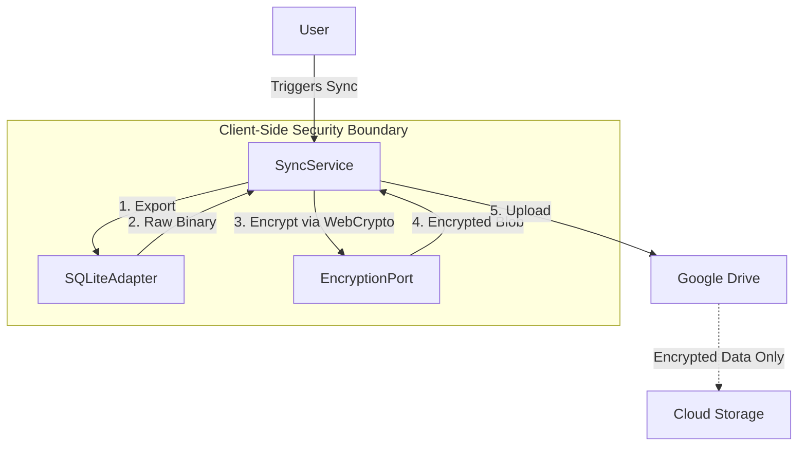

# System Reality Audit Results

## 1. Architectural Boundaries

- **Check**: Leakage of `next/` into `packages/core`.
- **Status**: ✅ **PASSED**.
- **Result**: `grep -r "next/" packages/core` returned 0 results. The core domain logic is strictly decoupled from the web framework.

## 2. Persistence & Security

- **Check**: Storage adapters usage of EncryptionPort.
- **Status**: ✅ **PASSED**.
- **Implementation**:
    - **Encryption**: `apps/web/src/lib/crypto/encryption.ts` implements AES-GCM 256-bit encryption with PBKDF2 key derivation.
    - **Adapters**: `GoogleDriveAdapter.ts` and `SQLiteAdapter.ts` handle raw I/O.
    - **Orchestration**: `apps/web/src/lib/sync/syncService.ts` correctly orchestrates the pipeline:
        - **Save**: `SQLite Export` -> `Encrypt` -> `Upload`
        - **Load**: `Download` -> `Decrypt` -> `SQLite Import`

## 3. Storybook Coverage

- **Check**: UI components missing stories.
- **Status**: ⚠️ **PARTIAL**.
- **Findings**: Significant gaps in Storybook coverage for core UI components.

### Missing Stories

| Category       | Components                                                                                                                                          |
| -------------- | --------------------------------------------------------------------------------------------------------------------------------------------------- |
| **Primitives** | `select`, `scroll-area`, `popover`, `label`, `checkbox`, `calculator-input`, `tabs`, `badge`, `dropdown-menu`, `table`, `dialog`, `switch`, `input` |
| **Domain**     | `AccountLedger`, `TransactionTable`, `SplitEntryDialog`, `ProjectionChart`, `SyncIndicator`                                                         |
| **Forms**      | `LoanDetailsForm`, `NewAccountDialog`, `WelcomeWizard`, `AccountEditForm`                                                                           |
| **Layout**     | `AppShell`, `Footer`, `Header`                                                                                                                      |

## 4. Recommendations

1.  **Prioritize Primitives**: Add stories for `input`, `select`, `dialog`, and `table` as they are foundational.
2.  **Domain Critical**: Add stories for `TransactionTable` and `SplitEntryDialog` to catch regression in complex interactions.
